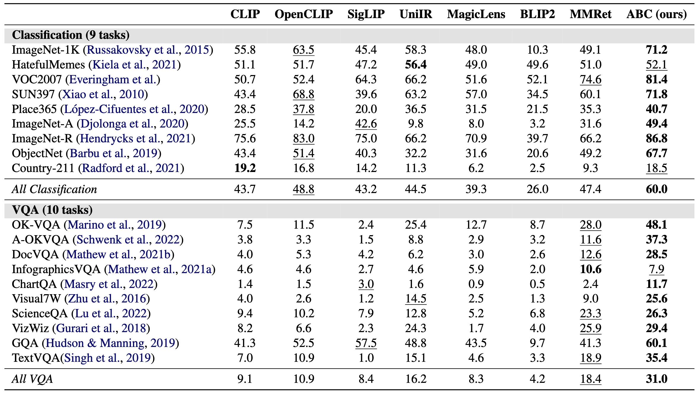

# ABC: Achieving Better Control of Multimodal Embeddings using VLMs
<a target="_blank" href="https://arxiv.org/abs/2503.00329">
</a>
<a target="_blank" href="https://github.com/TIGER-AI-Lab/ABC">
</a>
<a target="_blank" href="https://tiger-ai-lab.github.io/ABC/">
</a>
<a target="_blank" href="https://huggingface.co/TIGER-Lab/ABC-Qwen2VL-Instruct">
</a>
<a target="_blank" href="https://huggingface.co/datasets/TIGER-Lab/ABC-VG-Instruct">
</a>
<br>

<br>

<span style="font-size: 14pt; font-family: Roboto, Helvetica, Arial, Heveltica Neue, sans-serif">
     <b>Authors:</b>
     <a class="name" target="_blank" href="https://benjaminschneider.ca/">Benjamin Schneider</a>, 
     <a class="name" target="_blank" href="https://cs.uwaterloo.ca/~fkerschb/">Florian Kerschbaum</a>,
     <a class="name" target="_blank" href="https://wenhuchen.github.io/">Wenhu Chen</a>&nbsp; @ 
     <a class="btna" target="_blank" href="https://huggingface.co/TIGER-Lab">TIGER-Lab</a> &nbsp; 
     </span>

## 🔥News

- [2025/3/24] Added scripts to easily fetch our datasets from HF hub, includiong our large (200 GB) pretraining dataset. Our training script now directly pulls these datasets from the hub making it very easy to train yuor our models / adapters. I also added a batched inference embedding function (example in batched_demo.py).

- [2025/3/4] Release of the [ABC Paper](https://arxiv.org/abs/2503.00329), along with the first release of our [🤗 Model and Datasets](https://huggingface.co/collections/TIGER-Lab/abc-67bf2036a7c51b2a99aa9f54) on Hugging Face (more to come, stay tuned!).


## Overview


<details><summary>ABC's Design</summary>  


- We introduce ABC, an open-source multimodal embedding model that uses a
vision-language model backbone to deeply integrate image features with natural language
instructions.

- ABC is designed to give the user **maximum control** over how images are represented in embeddings. If you need to use naturral langauge to specify which aspects of an image you want emphasized and represented, ABC is the perfect model for you!

- The key behind ABC's training is that we pretrain the model using a large dataset of difficult embedding samples, where each batch contains many candidates that are relevant but not quite correct. The pretrained model is therefore able to generate embeddings that capture subtle differences. After a short finetuning stage, the model ideal for tasks like VQA, where differences in user instructions result in different correct answers (right).

- ABC outputs great quality embeddings, ABC achieves best-for-size performance on MSCOCO image-to-text retrieval and is the
top performing model on zero-shot classification and VQA tasks in the Massive Multimodal Embedding
Benchmark.

</details>

## 🤗 Models

| Model | Supports Instructions | Base Model | Training Dataset |
|:---------------------:|:-----------:|:----------------:|:--------------:|
| [ABC-Qwen2VL-Instruct](https://huggingface.co/TIGER-Lab/ABC-Qwen2VL-Instruct)  | ✅        | [ABC-Qwen2VL-Pretrain](https://huggingface.co/TIGER-Lab/ABC-Qwen2VL-Pretrain) | [TIGER-Lab/ABC-VG-Instruct]() |
| [ABC-Qwen2VL-Pretrain](https://huggingface.co/TIGER-Lab/ABC-Qwen2VL-Pretrain)  | ❌        | [Qwen2VL-Instruct](https://huggingface.co/Qwen/Qwen2-VL-7B-Instruct)     | [TIGER-Lab/ABC-Pretrain](https://huggingface.co/datasets/TIGER-Lab/ABC-Pretraining-Data)    |

## 📚 Datasets
- [ABC-VG-Instruct](https://huggingface.co/datasets/TIGER-Lab/ABC-VG-Instruct): A custom dataset for multimodal finetuning. Contains multiple instructions per image, each corresponding to different aspects of each image.
- [ABC-Pretrain](https://huggingface.co/datasets/TIGER-Lab/ABC-Pretraining-Data): Multimodal pretraining dataset with mined negatives.


## 🚀 Quick Start

Install Dependancies:
```bash
git clone $
cd ABC
pip install -r requirements.txt
```
Start making multimodal embeddings!
```bash
python -i ./quick_start.py
```

## 📈 Zero-shot Performance

Check out our [paper](https://arxiv.org/abs/2503.00329) for additional evaluations!


## Fetching Datasets from 🤗 Hub

Our datasets are hosted on HuggingFace Hub. The text data and dataset metadata can be fetched using HF's `load_dataset` utility.
To fetch the images from our datasets we provide scripts in the `fetch_datasets` directory.
These scripts will pull the pretraining/finetuning image data off the hub and unpack them in your huggingface datasets cache (under a directory called tigerlab).
Run `python ./fetch_datasets/pretrain.py` to get the pretraining dataset and `python ./fetch_datasets/instruct.py` to get the finetuning dataset, respectively.

## 🤖 Training

**1. Install all requirements.**
```
pip install -r training_requirements.txt
```
**2. Download the appropriate dataset.**  
Either thhe pretraining dataset:
```
python ./fetch_datasets/pretrain.py
```
or the instruction finetuning dataset:
```
python ./fetch_datasets/instruct.py
```
**3. Update Config**  
Find the config you want to run in the `config` folder
(Currently the example configs are nested under the `qwen` folder, one for pretraining and one for finetuning).
At minimum, change the `output_dir` field to where you want to the checkpoints to be saved.
Feel free to change any other settings in your chosen config. 😊

**4. Run the training script**  
The `scripts` directory contains a file for training the model with different GPU / system config settings:
```
./scripts/qwen_finetune.sh {GPU} {PORT} {CONFIG_PATH}
```
for example:
```
./scripts/qwen_finetune.sh 0,1 44000 ./config/qwen/QwenVL-8B-Instruct.json
```
Runs our pretraining on GPUs 0,1 with communication over port 44000. 
his script still works if you only want to specify a single GPU for your training.

If encounter any problems please open an issue on this repo. 😊

## Citation
If you find this work helpful, please consider citing:
```bibtex
@misc{schneider2025abcachievingbettercontrol,
      title={ABC: Achieving Better Control of Multimodal Embeddings using VLMs}, 
      author={Benjamin Schneider and Florian Kerschbaum and Wenhu Chen},
      year={2025},
      eprint={2503.00329},
      archivePrefix={arXiv},
      primaryClass={cs.CV},
      url={https://arxiv.org/abs/2503.00329}, 
}
```
